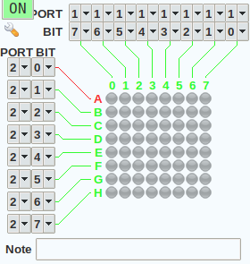
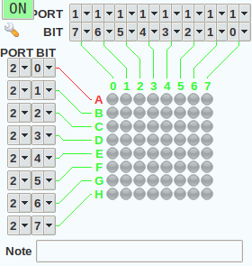

# Game of Life for 8051 microcontroller

Project for microcontroller programming course at DHBW Karlsruhe.

## Run
- Import the [project file](src/game-of-life.mcu8051ide) into the [MCU 8051 IDE](https://sourceforge.net/projects/mcu8051ide/)
- Load the virtual hardware files from the directory [src/vhc](src/vhc) with Virtual HW > Load into the IDE
- Start the Simulator

## Input
Port 0

Init value is 1111 111  
Port 0.0 -> 0 = start | 1 = wait 
Port 0.1 & 0.2 -> binary digit for state number (00, 01, 10, 11) 
Port 0.3 -> 1 = random | 0 = looking for state 

Examples: 
1111 0000 -> start with state 0 
1111 0010 -> start with state 1 
1111 0100 -> start with state 2 
1111 0110 -> start with state 3 
1111 1000 -> start with random state (overwrite state 0) 
1111 1100 -> start with random state (overwrite state 3) 
1111 XXX1 -> waiting until last bit is 0, checking each seconde 

## Output
Port 1: Data of current row. 1 is on and 0 is off

Port 2: Number of current row. 00000100 means third row.

## Result
| Name | Animation |
| ----------- | ----------- |
| Pedal |  |
| Kegel |  |
| Unruh |  |
| Strudel |  |

## Field
- current Field: 70h
- new Field: 78h

## DB
four predefined start figures: 
- pedal
- kegel
- unruh
- strudel

## Team
- Init + Input: Jan
- Random: Sebastian
- Calculate states: Nicole
- Multiplex display: Jonathan

## Deadline
**24.06.2020**
